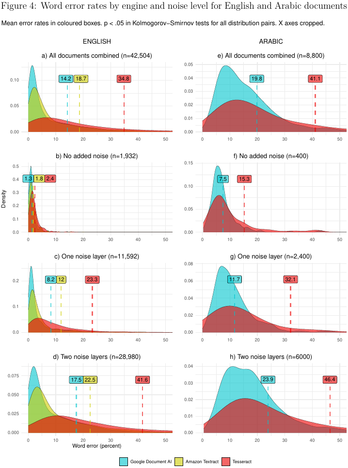

# An OCR Benchmarking Experiment
  
This repository holds replication materials for the manuscript "OCR with Tesseract, Amazon Textract, and Google Document AI: A Benchmarking Experiment". It contains:

- The .RMD file of the manuscript with R code for all the figures.
- 51,304 .TXT files with the text output from all the OCR processing requests.
- A .CSV file with word and character accuracy rates for all the OCR output.

The raw image test materials reside in a separate repository for space reasons.

From the abstract: 

>This article reports a benchmarking experiment comparing the performance of Tesseract, Amazon Textract, and Google Document AI on images of English and Arabic text. English-language book scans (n=322) and Arabic-language article scans (n=100) were replicated 43 times with different types of artificial noise for a corpus of 18,568 documents, generating 51,304 process requests. Document AI delivered the best results, and the server-based processors (Textract and Document AI) were substantially more accurate than Tesseract, especially on noisy documents. Accuracy for English was considerably better than for Arabic.

Core results: 
\
\

